# ja-sky130-pd-workshop

This is the lab report of the sky130-pd-workshop

# Day 1

To start the RTL to GDSII flow, we first go to the openlane directory and run docker, then start the flow in interactive mode using the picorv32a design

Run commands:

```
cd
source .bashrc

cd ~/Desktop/work/tools/openlane_working_dir/openlane

docker
./flow.tcl -interactive

package require openlane 0.9

prep -design picorv32a
```

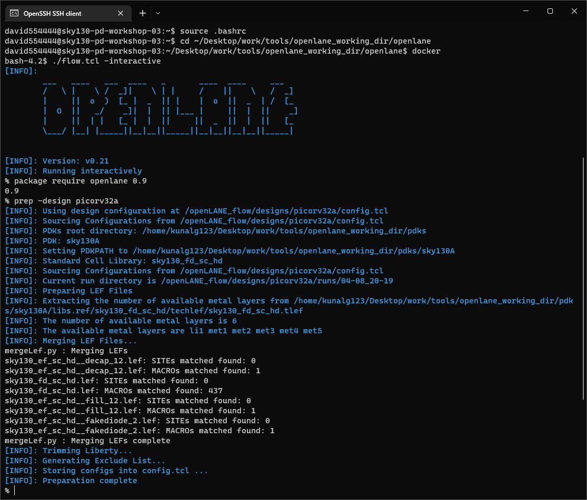

After that, the runs directory is created inside the designs/picorv32a folder

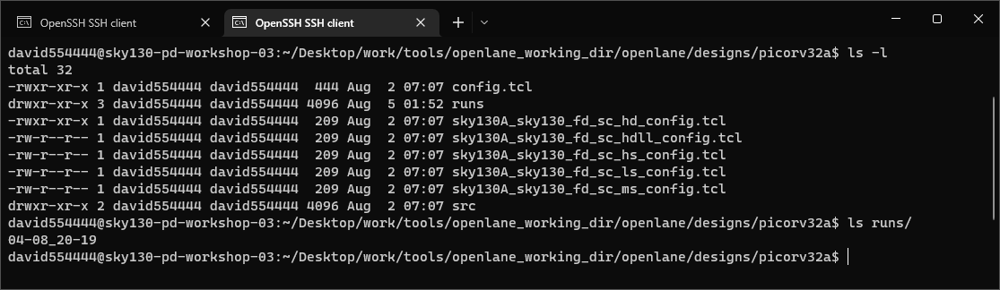

We run synthesis with the command:
`run_synthesis`

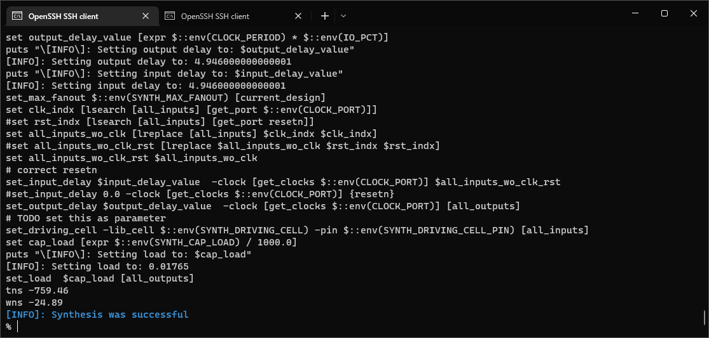

Note that tns and wns are both negative

We calculate flop ratio and buffer ratio

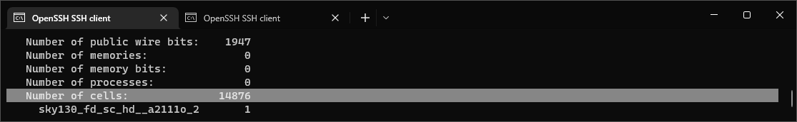

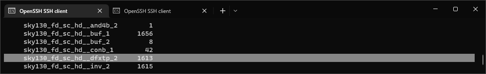

Flop ratio = Number of dfxtp cells / Number of cells = 1613 / 14876 = 0.1084 

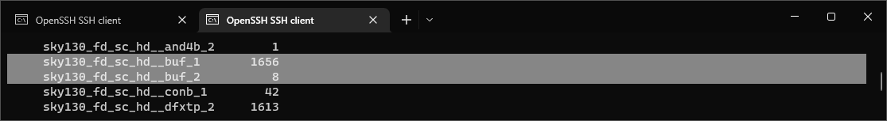

Buffer ratio = (Number of buf cells) / Number of cells = (1656 + 8) / 14876 = 0.11185

# Day 2

## Floorplan

After the synthesis is done, we run the floorplan where we place things like the io pins and preplaced cells (standard cells are not yet placed). The floorplan has several configurations just like the synthesis that modify the behaviour and thus the results of the step, we run it with default values.

`run_floorplan`

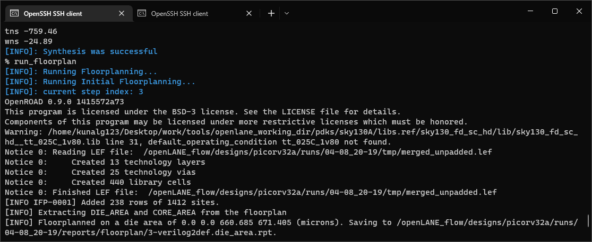

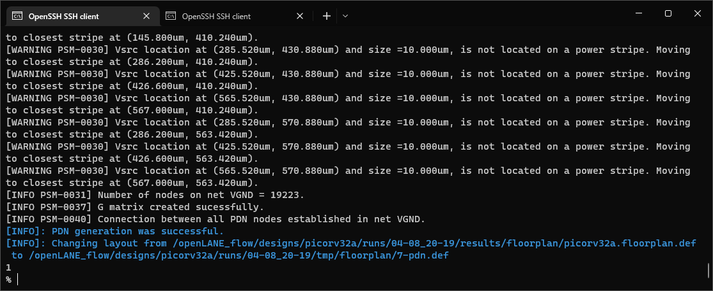

Die area

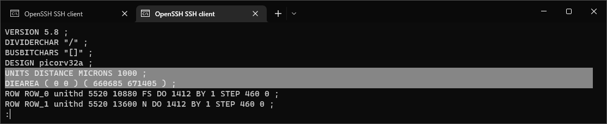

Die area is of 660685/1000 [um] * 671405/1000 [um] = 443587.212425 [(um)^2]

To see the layout, from the runs/<run>/results/floorplan folder we run

magic -T ~/Desktop/work/tools/openlane_working_dir/pdks/sky130A/libs.tech/magic/sky130A.tech lef read ../../tmp/merged.lef def read picorv32a.floorplan.def &

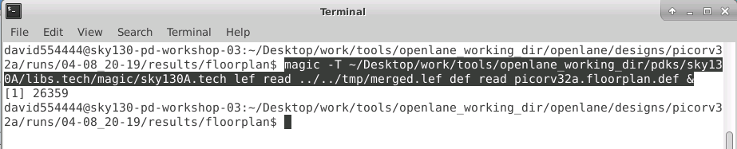

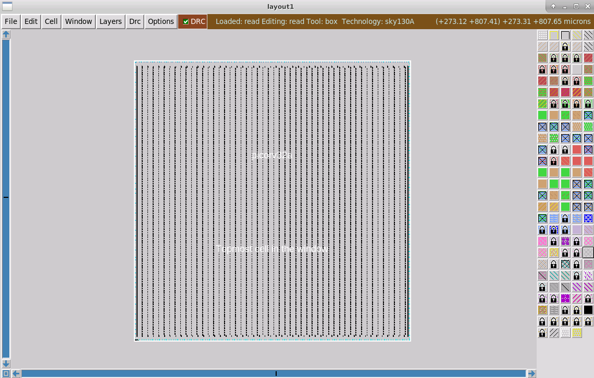

We can see the distribution of the IO pins

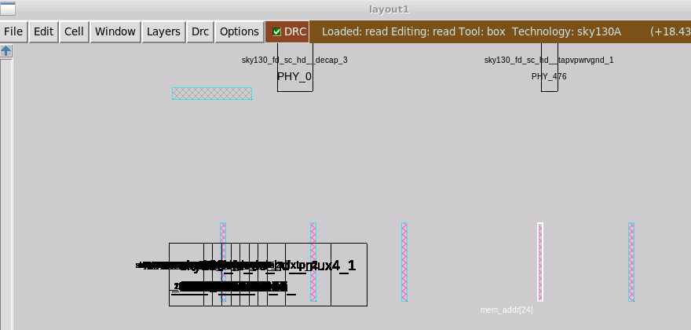

Standard cells are kept in the lower left corner (they are not placed yet)

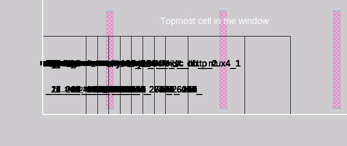

## Placement

In this step, the standard cells are placed in the core.

`run_placement`

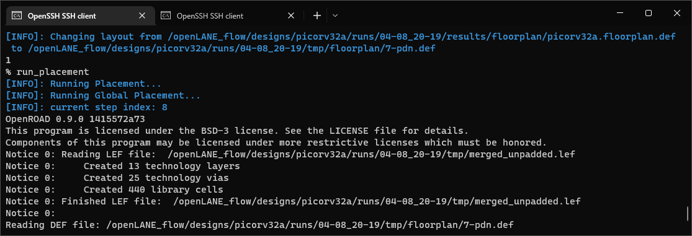

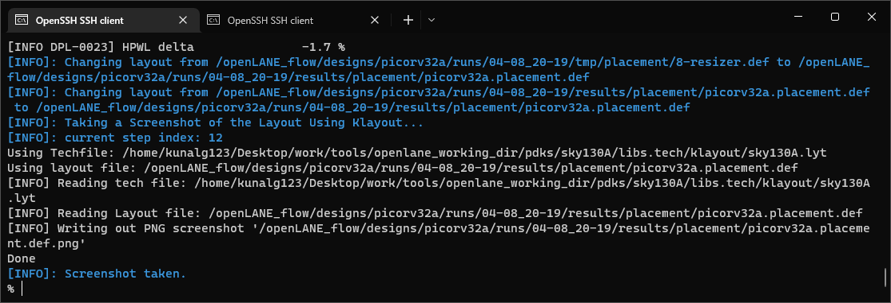

From the runs/<run>/results/placement folder we run

magic -T ~/Desktop/work/tools/openlane_working_dir/pdks/sky130A/libs.tech/magic/sky130A.tech lef read ../../tmp/merged.lef def read picorv32a.placement.def &

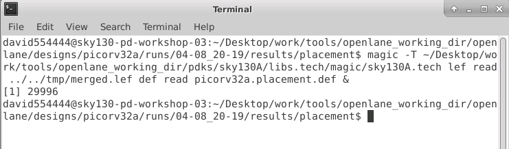

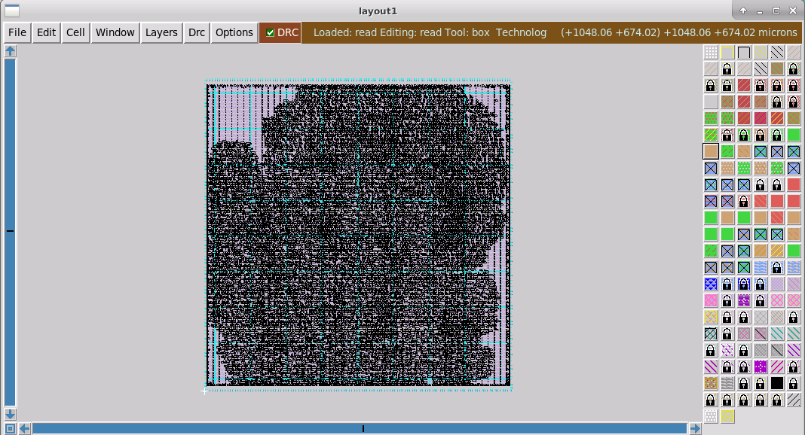

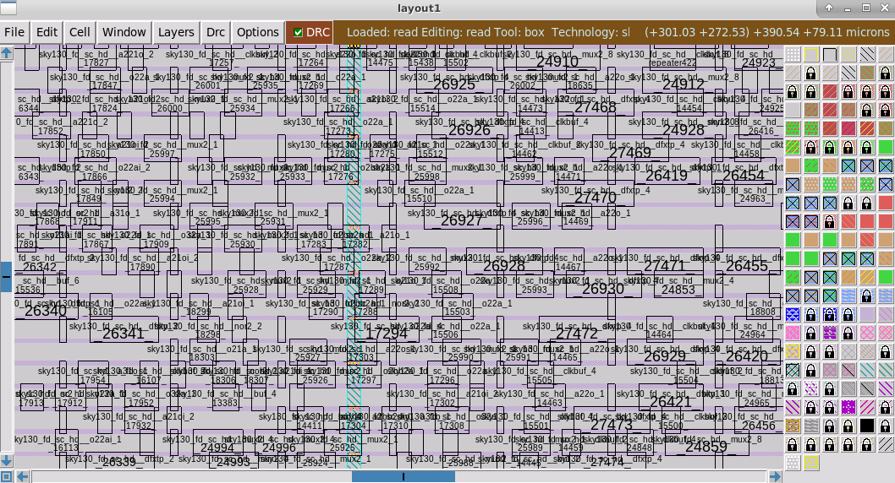

We can see all the standard cells are now placed across the core area.
