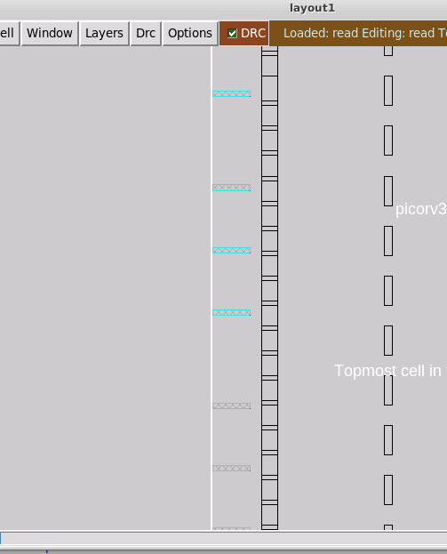
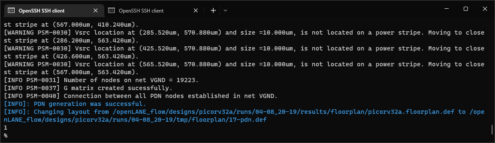
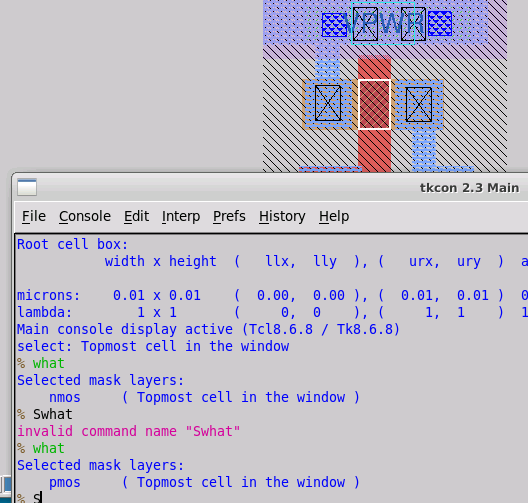
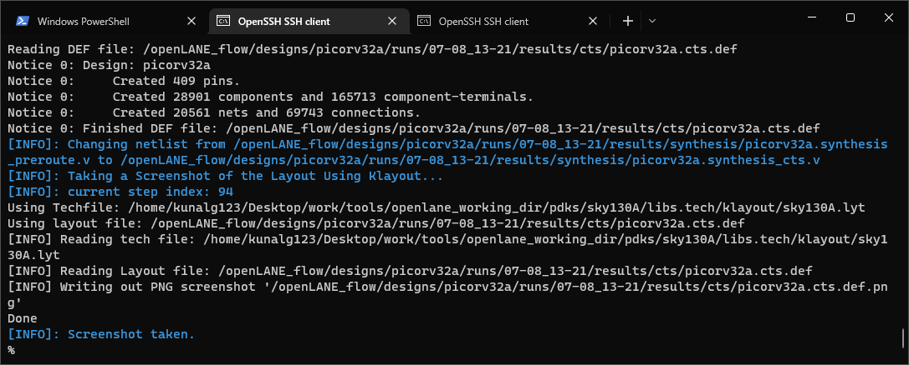
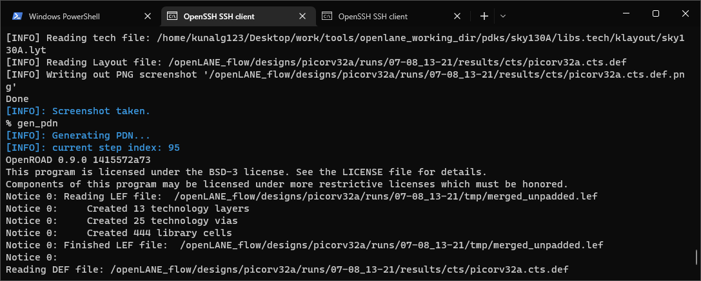

# ja-sky130-pd-workshop

This is the lab report of the sky130-pd-workshop

Quick navigation
- [Day 1](#day-1)
	- [Floorplaning](#floorplan)
	- [Placement](#placement)
- [Day 2](#day-2) 
- [Day 3](#day-3) 
	- [IO placer](#io-placer) 
	- [Custom cells](#custom-cells) 
	- [Spice model](#spice-model-extraction-and-characterization) 
- [Day 4](#day-4) 
	- [STA](#static-timing-analysis) 
	- [CTS](#clock-tree-synthesis) 
- [Day 5](#day-5) 

# Day 1

To start the RTL to GDSII flow, we first go to the openlane directory and run docker, then start the flow in interactive mode using the picorv32a design

Run commands:

```
cd
source .bashrc

cd ~/Desktop/work/tools/openlane_working_dir/openlane

docker
./flow.tcl -interactive

package require openlane 0.9

prep -design picorv32a
```


After that, the runs directory is created inside the designs/picorv32a folder


We run synthesis with the command:
```
run_synthesis
```


Note that tns and wns are both negative

We calculate flop ratio and buffer ratio


Flop ratio = Number of dfxtp cells / Number of cells = 1613 / 14876 = 0.1084 


Buffer ratio = (Number of buf cells) / Number of cells = (1656 + 8) / 14876 = 0.11185

# Day 2

## Floorplan

After the synthesis is done, we run the floorplan where we place things like the io pins and preplaced cells (standard cells are not yet placed). The floorplan has several configurations just like the synthesis that modify the behaviour and thus the results of the step, we run it with default values.

```
run_floorplan
```


Die area


Die area is of 660685/1000 [um] * 671405/1000 [um] = 443587.212425 [(um)^2]

To see the layout, from the `runs/<run>/results/floorplan` folder we run

```
magic -T ~/Desktop/work/tools/openlane_working_dir/pdks/sky130A/libs.tech/magic/sky130A.tech lef read ../../tmp/merged.lef def read picorv32a.floorplan.def &
```


We can see the distribution of the IO pins


Standard cells are kept in the lower left corner (they are not placed yet)


## Placement

In this step, the standard cells are placed in the core.

`run_placement`


From the `runs/<run>/results/placement` folder we run

```
magic -T ~/Desktop/work/tools/openlane_working_dir/pdks/sky130A/libs.tech/magic/sky130A.tech lef read ../../tmp/merged.lef def read picorv32a.placement.def &
```


We can see all the standard cells are now placed across the core area.

# Day 3

## IO placer

We go back to running magic on the floorplan



Pins should be equidistant, but they don't look like it because there are places where there are no pins

On openlane, we can change the variables with a command

we are gonna change FP_IO_MODE

```
set ::env(FP_IO_MODE) 2
```

and then we run floorplan again

```
run_floorplan
```




running magic to see the io distribution after the floorplan

From `runs/<run>/results/floorplan` folder

```
magic -T ~/Desktop/work/tools/openlane_working_dir/pdks/sky130A/libs.tech/magic/sky130A.tech lef read ../../tmp/merged.lef def read picorv32a.floorplan.def &
```

looks like the io pins are distributed along half of the left side and the down side


## Custom cells

We first need to download a repository

On the openlane folder we clone the repo

```
git clone https://github.com/nickson-jose/vsdstdcelldesign
```


We have to open the .mag file (layout of the inverter) with magic, but we need the .tech file

the .tech file is located on `openlane_working_dir/pdks/sky130A/libs.tech/magic/sky130A.tech`

we copy the tech file to the folder of the repo

(Running from the folder of the repo)
```
cp ~/Desktop/work/tools/openlane_working_dir/pdks/sky130A/libs.tech/magic/sky130A.tech .
```


now we run magic

```
magic -T sky130A.tech sky130_inv.mag &
```


On the layout, colors on the right represent the layers (for example ndifussion, metal1, etc), hovering over them shows the name of the layer on the top of the GUI





To check if there's a connection to a component, we press S multiple times while hovering over it 

To see things connected to the output

1 time to select the output


2 times to select the connections of the output


## Spice model extraction and characterization

To simulate, we first need to get the spice model


we take the .ext file to create the spice file


Contents of the file


On the spice file we check the scale

We check the size of a singular unit of the grid in the layout, and  from that change the scale in the spice file (0.01u)


We also have to include the .lib files, include power supplies and stimulus (a pulse output at the input of the inverter), also define the parameters for transient analysis, and update the names of the models of the pmos and nmos to reflect those in the .lib files


To run ngspice simulation based on the spice deck we execute

```
ngspice sky130_inv.spice
```


To plot the output (y) and input (a) vs time we run

```
plot y a vs time
```


To characterize it, we find the rise/fall delay


### Rise delay

When the output is rising, we measure the time delta between 20%  of the maximum value and 80% of the maximum value

max value is 3.3V

20%


80%


cell rise delay = 2.195n - 2.152n = 0.043n

### Fall delay

Procedure is similar

80%


20%


cell fall delay = 4.06642n - 4.0403n = 0.02612n

# Day 4

We continue with the inverter cell, so we open the inverter in magic

run magic from  `~/Desktop/work/tools/openlane_working_dir/openlane/vsdstdcelldesign`

```
magic -T sky130A.tech sky130_inv.mag &
```


We need to check that the input and outputs (A and Y) are aligned with horizontal and vertical tracks of the local interconnect (locali)

Information on the tracks is on 

`~/Desktop/work/tools/openlane_working_dir/pdks/sky130A/libs.tech/openlane/sky130_fd_sc_hd/tracks.info`

we check layer li1


on the tkcon console we configure the grid to the dimensions of the li1

```
grid 0.46um 0.34um 0.23um 0.17um
```

We also check that the width of the cell is a multiple of the x pitch


Before extracting the lef file we save it with the name `sky130_vsdinv.mag`

on tkcon console
```
save sky130_vsdinv.mag
```

then close magic and open the saved cell

```
magic -T sky130A.tech sky130_vsdinv.mag &
```

then on tkcon console we generate the lef file

```
lef write
```


Contents of the file


We then copy this lef file to the `picor32va/src` folder

```
cp sky130_vsdinv.lef ~/Desktop/work/tools/openlane_working_dir/openlane/designs/picorv32a/src/
```

we also copy the `sky130_fd_sc_hd_*.lib` files inside the libs folder to the `picorv32a/` folder.

```
cp libs/sky130_fd_sc_hd_*.lib ~/Desktop/work/tools/openlane_working_dir/openlane/designs/picorv32a/src/
```

we also add these lines to the `picorv32a/config.tcl`

```
set ::env(LIB_SYNTH) "$::env(OPENLANE_ROOT)/designs/picorv32a/src/sky130_fd_sc_hd__typical.lib"
set ::env(LIB_FASTEST) "$::env(OPENLANE_ROOT)/designs/picorv32a/src/sky130_fd_sc_hd__fast.lib"
set ::env(LIB_SLOWEST) "$::env(OPENLANE_ROOT)/designs/picorv32a/src/sky130_fd_sc_hd__slow.lib"
set ::env(LIB_TYPICAL) "$::env(OPENLANE_ROOT)/designs/picorv32a/src/sky130_fd_sc_hd__typical.lib"

set ::env(EXTRA_LEFS) [glob $::env(OPENLANE_ROOT)/designs/$::env(DESIGN_NAME)/src/*.lef]
```

Now we start the openlane flow

and we run the next two commands

```
set lefs [glob $::env(DESIGN_DIR)/src/*.lef]

add_lefs -src $lefs
```

Then we run the synthesis

```
run_synthesis
```

We that the see the cell is begin used


tns -711.59
wns -23.89
Chip area for module '\picorv32a': 
147712.918400

We try to improve the timing by changing the synth strategy

```
set ::env(SYNTH_STRATEGY) "DELAY 0"
```

and run synthesis again


tns 0.00
wns 0.00
Chip area for module '\picorv32a': 
196832.528000

Area increases, but TNS and WNS are 0

Now we run floorplanning, placement and routing, running `run_floorplan` results in an error, so we execute the next set of commands, which not only perform floorplaning, but also run placement, generate power distribution network and generate routing

```
init_floorplan
place_io
global_placement_or
detailed_placement
tap_decap_or
detailed_placement
gen_pdn
run_routing
```


we open the layout in magic

```
magic -T ~/Desktop/work/tools/openlane_working_dir/pdks/sky130A/libs.tech/magic/sky130A.tech lef read ../../tmp/merged.lef def read picorv32a.placement.def &
```


We zoom and find the cell in the layout


we run expand on the tkcon console


## Static timing analysis

We will do timing analysis in OpenSTA

checking the `*typical.lib`


Capacitance of 2.328 is updated in `my_base.sdc`


We update `sta.conf`


We run

```
sta sta.conf
```

and we get


## Clock tree synthesis

Before running synthesis we replace our synthesis results with the provided .v file and continue from floorplan

then we run CTS

```
run_cts
```


The step fails with error `[utilization exceeds 100%]`

To fix the error we have to define a variable

```
set ::env(CURRENT_DEF) /openLANE_flow/designs/picorv32a/runs/07-08_13-21/results/placement/picorv32a.placement.def
```

Then we run CTS step again




the step runs successfully

# Day 5

We generate the power distribution network

run
```
gen_pdn
```




then we run routing

```
run_routing
```


